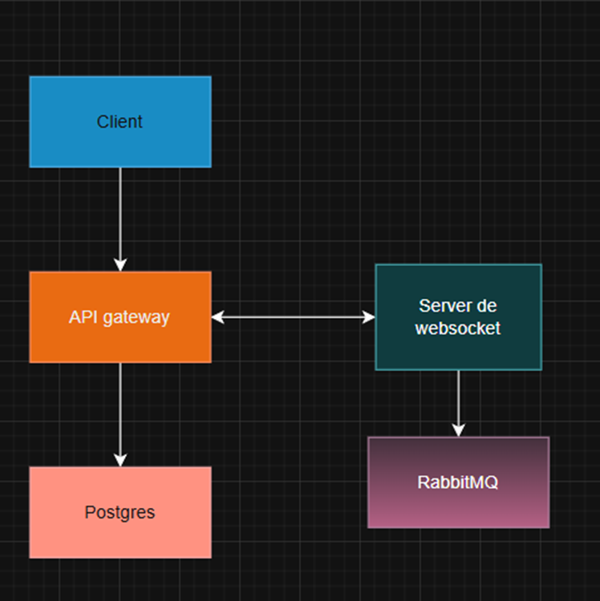

# Chat en Tiempo Real con WebSockets, RabbitMQ y PostgreSQL

Se busca implementar una plataforma de chat en tiempo real con manejo de salas, autenticación, mensajería persistente.

## Características Principales

- Autenticación con JWT
- Comunicación en tiempo real con Socket.IO
- Salas públicas y privadas
- Acceso protegido por contraseña en salas privadas
- Persistencia de mensajes en PostgreSQL
- Historial con paginación vía API REST
- Notificaciones de usuario escribiendo
- RabbitMQ como broker para distribución de mensajes
- Infraestructura lista con Docker Compose
- soporte para múltiples clientes y concurrencia

## Arquitectura

## Patrones utilizados
- Frontend y backend: Cliente servidor
- RabbitMQ y websocket: Event–Driven Architecture
- RabbitMQ: Message broker
- Visualizacion de mensajes en las salas: Publisher/Subscriber

## Tecnologias
- Frontend: React - Vite - Socket.io
- Backend: Node.js - Express
- Broker: RabbitMQ
- BDD: PostgreSQL
- Auth: JWT (JSON Web Token)
- Infrastructura: Docker compose

